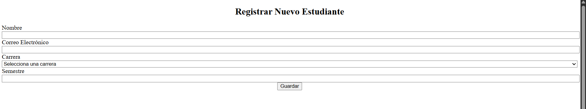
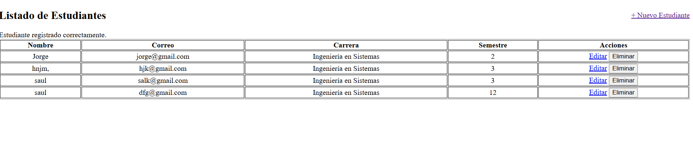

CRUD de Estudiantes con Laravel 12, Tailwind CSS y Vite

Este proyecto es una aplicación web desarrollada con Laravel 12 que permite gestionar estudiantes de forma eficiente. Incluye operaciones de crear, leer,actualizar y eliminar y responsiva gracias a Tailwind CSS y Vite.

---

Funcionalidades

-  Listado de estudiantes con tabla 
-  Registro de nuevos estudiantes
-  Edición de datos existentes
-  Eliminación segura
-  Validación de campos
-  Asociación con carreras académicas

---

Tecnologías utilizadas

- Laravel 12
- Tailwind CSS 4
- Vite
- Blade Templates
- MySQL
- PHP 8+

Evidencia de funcionamiento 

 Repositorio git:

